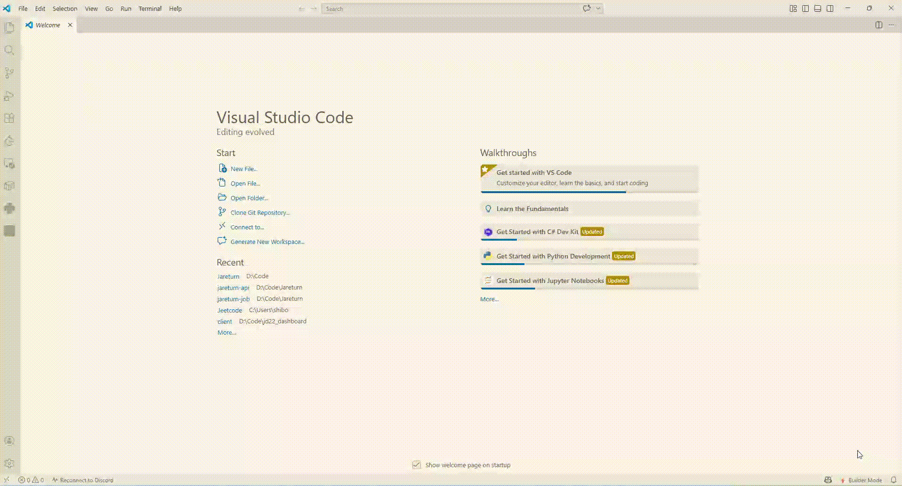

# Cursor Learning Mode

Switch between **Builder Mode** (normal coding help) and **Learning Mode** (tutor-style guidance) from the status bar—without leaving your editor.

## Install

- **From the Marketplace:** search for **Cursor Learning Mode** and install.
- **From a VSIX:** Extensions → **⋯** → **Install from VSIX…** and choose the packaged `.vsix` file.

## Quick start

1. **Open a folder** as your workspace (the extension needs a workspace to sync Cursor rules).
2. Look at the **bottom-right status bar** for **Learning Mode** or **Builder Mode**.
3. **Click** the label to toggle modes, or use the **Learning Mode** icon in the activity bar for the sidebar panel.

## How to use

### Status bar (main control)

- **Learning Mode** — Tutor-style responses: blueprint first, scaffolds, hints, and guiding questions before full solutions.
- **Builder Mode** — Standard assistant behavior for faster, direct help.

Click the status item any time to switch. Your choice is saved across sessions.

### Cursor Chat (default chat)

With **Learning Mode** on, the extension writes a project rule at `.cursor/rules/learning-mode.mdc` so **Cursor’s default chat** can follow the tutor-style instructions (when rules are enabled in Cursor).

- Switch to **Builder Mode** to remove that rule file so chat is not forced into tutor mode.
- If rules feel sticky after toggling, try **Developer: Reload Window** and start a **new chat**.

### Command Palette (`Ctrl+Shift+P` / `Cmd+Shift+P`)

| Command | What it does |
| -------- | ------------- |
| **Toggle Learning Mode** | Switches between Learning and Builder mode. |
| **Enable Learning Mode** | Turns Learning Mode on. |
| **Enable Builder Mode** | Turns Builder Mode on. |
| **Generate Learning Hint** | Builds a hint prompt and **copies it to the clipboard** (paste into chat if you want a one-off guided reply). |
| **Generate Scaffold** | Builds a scaffold prompt and **copies it to the clipboard**. |

### Keyboard shortcut

- **`Ctrl+Shift+L`** (when the editor has focus) — same as **Toggle Learning Mode**.

### Sidebar

Open **Learning Mode** in the activity bar to see the current mode, short description, and quick actions.

## Tips

- **Workspace required** for automatic `.cursor/rules` sync: open **File → Open Folder…** (not only loose files).
- Learning Mode shapes **guidance**; it does not replace Cursor’s own chat behavior in every edge case. For the strictest tutor flow, keep Learning Mode on and use a fresh chat after toggling.

## For developers

Clone the repo, run `npm install` and `npm run compile`, then press **F5** in VS Code/Cursor to run the extension in an Extension Development Host. See `package.json` scripts for packaging (`vsce package`).

### Project layout

- `src/extension.ts` — Activation, commands, status bar, Cursor rule sync.
- `src/modeManager.ts` — Mode state and persistence.
- `src/promptEngine.ts` — Learning vs builder prompt text for rules and clipboard commands.
- `src/webview/` — Sidebar webview UI.
